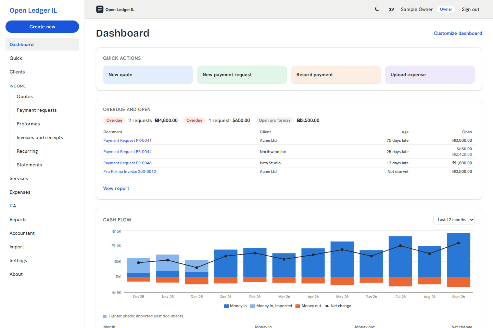
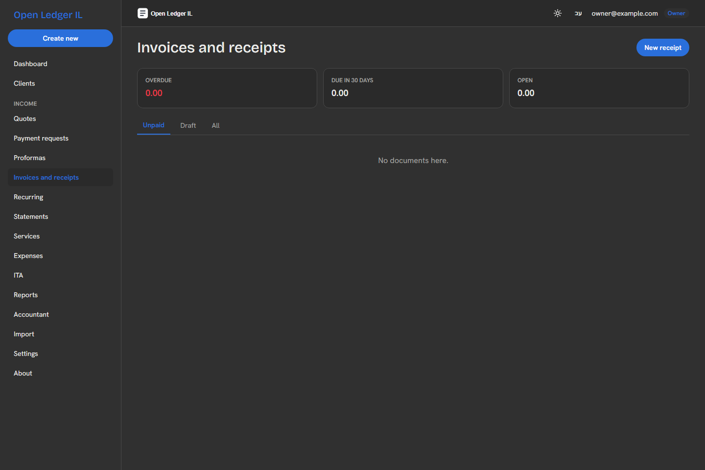
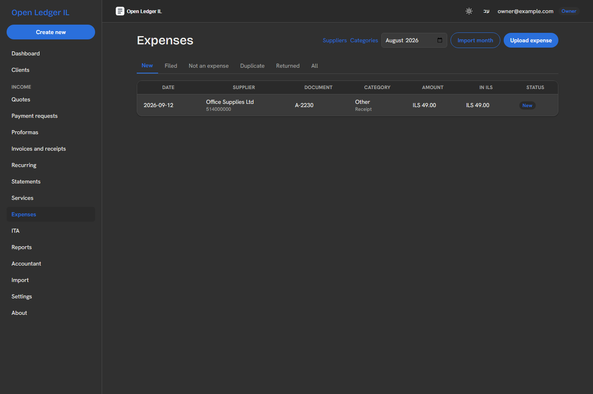
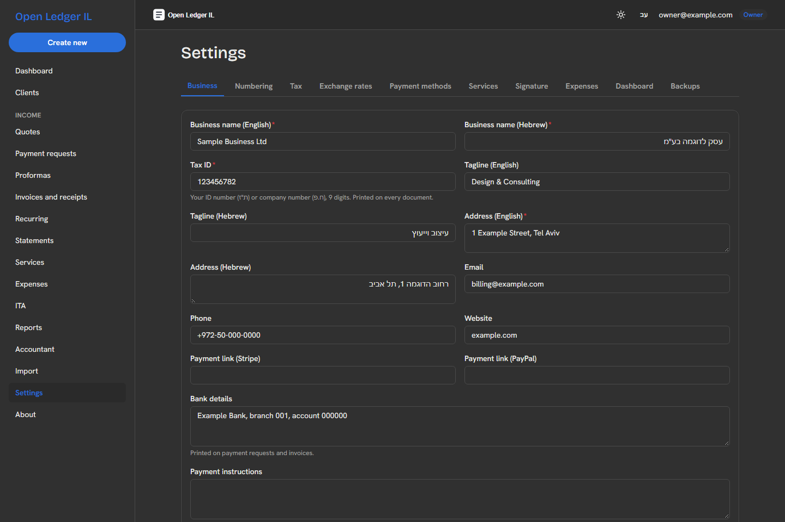

# MTN - Open Ledger IL

Open-source invoicing, expenses and bookkeeping for Israeli businesses. Built for עוסק פטור and עוסק מורשה. Runs on your own Cloudflare account. Your data stays in your own database.

Product page: [English](docs/index.html) · [עברית](docs/he.html). Turn on GitHub Pages from the `/docs` folder to publish it.

> **Not tax or legal advice.** You are responsible for compliance with Israeli law and ITA requirements. Check your setup with your accountant before you issue a real document.

## Who it is for

- A עוסק פטור who issues quotes, payment requests and receipts, and watches the annual ceiling.
- A עוסק מורשה who issues tax invoices with VAT and needs allocation numbers from the ITA (חשבוניות ישראל).
- A business owner who wants an accountant to see the books without handing over the keys.

## Features

- **Documents.** Quotes, payment requests, pro forma invoices, receipts and credit receipts in פטור mode. Tax invoices, invoice/receipts and credit invoices in מורשה mode. English or Hebrew documents, bilingual filed copies.
- **Recurring and duplicate.** Copy any document in one click. Schedule a payment request, pro forma or tax invoice weekly, monthly, quarterly or yearly, held for your approval or issued and emailed automatically.
- **Legal numbering.** One series per document type, no gaps, no reuse. A final document never changes. A hash chain and D1 triggers enforce both.
- **Signed PDFs.** Cloudflare Browser Rendering draws the PDF. A PAdES signature with your own key secures the file.
- **ITA allocation numbers.** The Israel Invoices API v2 client, sandbox and production, with a retry queue and a refusal decision flow.
- **Foreign currency.** Bank of Israel rates, cached daily. ILS amounts on foreign-currency documents.
- **פטור ceiling.** A turnover meter, alerts at 70, 85, 95 and 100 percent, and a guided switch to עוסק מורשה.
- **Expenses.** Upload a receipt or import a month from Google Drive. Claude reads each document. You review and file.
- **Reports.** Income, expenses, profit and loss, per-client ledgers, and a monthly accountant pack (PDF, XLSX, ZIP).
- **Accountant access.** A separate role with per-feature switches, an end date and a full access log.
- **Exports.** The ITA unified file (מבנה אחיד). A PCN874 export with the allocation-number column (other columns are a stub).
- **Import.** Customers and invoice history from Wave CSV exports and the SUMIT unified file. Upload documents issued in another system.
- **Backups.** A quarterly D1 export with a restore test, stored in R2 and copied to Google Drive.

## Screenshots

All screenshots come from the demo database (`npm run seed:demo`). Every name in them is invented.

| Dashboard | Documents |
|---|---|
|  |  |
| **Expenses** | **Settings** |
|  |  |

Sample PDFs, one of each document type: `docs/screenshots/pdf/`.

## Stack

One Cloudflare Worker (Hono) serves the API and the web app (React, Vite, Tailwind). D1 holds the data. R2 holds files. Cloudflare Access signs people in. TypeScript in strict mode, Vitest for tests. See `docs/architecture.md`.

## Get started

1. Deploy to your Cloudflare account: `docs/deploy.md`.
2. Set up your business, logo, signature and numbering: `docs/setup.md`.
3. Add secrets: `docs/secrets.md`.

Try the app locally first:

```
npm ci
cp .dev.vars.example .dev.vars
npm run db:migrate:local
npm run seed:demo -- --local
npm run dev
```

`seed:demo` fills the local database with an invented business, clients, documents and expenses. The script refuses to run without `--local`.

## Documentation

| File | What the file holds |
|---|---|
| `docs/deploy.md` | Deploy to Cloudflare, step by step |
| `docs/setup.md` | First run: business profile, logo, signature, numbering |
| `docs/secrets.md` | Every secret and binding |
| `docs/architecture.md` | Request flow, numbering, hash chain, module map |
| `docs/legal-requirements.md` | Israeli bookkeeping and VAT rules mapped to features |
| `docs/compliance-checklist.md` | Each legal rule and the test covering the rule |
| `docs/israel-invoices-api.md` | ITA allocation-number integration |
| `docs/currency-and-fx.md` | Foreign-currency rules |
| `docs/accountant-access.md` | The accountant role |
| `docs/cloudflare-access.md` | Cloudflare Access setup |
| `docs/drive-expenses-setup.md` | Google Drive expense import |
| `specs/` | Official ITA specifications, with source links |

Code comments name build runs (R00 to R22) from the original build plan. The run files are not part of this repository.

## Contributing and security

See `CONTRIBUTING.md` and `SECURITY.md`. Run `node scripts/leak-check.mjs` before every commit.

## License

GNU Affero General Public License v3.0. See `LICENSE`. Copyright MTN.
